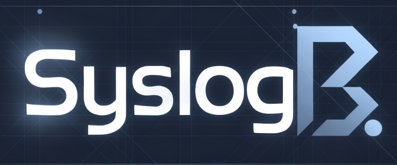

<p align="center">
  
</p>

# log-intel — Unified Log Intelligence

Single app combining **syslogb** (file logs, search, LLM/RAG, alerts) and a **network hub** (syslog ingest, Palo Alto parsing, geo flows).

Replaces standalone **syslogb**, **loggy**, and **netsyslog**. See [DEPRECATION.md](DEPRECATION.md).

| UI | URL |
|----|-----|
| File logs (syslogb) | http://host:9088/ |
| Network hub | http://host:9088/hub |
| Syslog ingest | UDP/TCP **514** (or remapped host port, e.g. **5516**) |

## Features

**File logs (`/`)** — multi-directory tail, search, export, LLM analysis, RAG/Chroma, alerts, auth, settings wizard.

**Network hub (`/hub`)** — Palo Alto + Windows syslog ingest, GeoIP, live feed, firewall view, flow map, hub Ollama triage.

## Requirements

- Python **3.11+** (native install) or Docker
- Read access to log directories (often `adm` group on Linux)
- **GeoIP** (optional): DB-IP Lite or GeoLite2 City → `geoip/dbip-city-lite.mmdb`
- **LLM** (optional): OpenAI-compatible API, Berget, Grok, or local Ollama — same choices as syslogb

Tail, search, and hub ingest work without any LLM.

## Quick start (recommended)

Same one-step flow as syslogb:

```bash
git clone <your-repo>/log-intel.git
cd log-intel
./install.sh
```

`install.sh` creates a venv, installs dependencies, seeds `.env`, generates `FLASK_SECRET_KEY`, and (for hybrid/OpenAI/Grok setups) runs the local **embed server** on port **11435** automatically.

Then start:

```bash
source .venv/bin/activate
log-intel                    # dev server
# or production:
gunicorn -w 1 -k gthread --threads 8 --timeout 600 \
  -b 0.0.0.0:9088 log_intel.wsgi:application
```

Open **http://localhost:9088/** — on first visit, complete **Settings** if prompted.

### LLM setup menu (`./install.sh`)

| Choice | Chat | Embeddings (large files) |
|--------|------|---------------------------|
| **Berget AI** | api.berget.ai | api.berget.ai |
| **Grok / xAI** | api.x.ai | local Ollama :11435 |
| **OpenAI / compatible** [default] | your API | local Ollama :11435 |
| **All-local Ollama** | your Ollama host | same host |

Non-interactive:

```bash
LOG_INTEL_LLM_SETUP=ollama LOG_INTEL_OLLAMA_BASE_URL='http://192.168.1.10:11434' ./install.sh
LOG_INTEL_LLM_SETUP=berget LOG_INTEL_LLM_API_KEY='…' ./install.sh
LOG_INTEL_SKIP_OLLAMA=1 ./install.sh   # skip embed server install
```

Legacy syslogb env names still work: `SYSLOGB_LLM_SETUP`, `SYSLOGB_LLM_API_KEY`, etc.

### All-local Ollama

After choosing **All-local Ollama**, pull models on that host:

```bash
ollama pull qwen3.6:27b-q8_0
ollama pull nomic-embed-text
```

Set `LOG_INTEL_LLM_ENABLED=1` in `.env` to enable hub background triage.

## Docker (production)

```bash
cp .env.example .env    # or run ./install.sh first, then docker compose
# Edit .env: LOG_DIRS, auth, OLLAMA_BASE_URL (use host.docker.internal for host Ollama)

docker compose up -d --build
```

Default port map: **9088** (HTTP), **5516→514** (syslog). Mounts `/var/log`, `/var/log/remote`, `./data`, `./geoip`.

Compose loads all settings via `env_file: .env`.

## Configuration

| Source | Purpose |
|--------|---------|
| `.env` | Bootstrap + Docker; secrets (`FLASK_SECRET_KEY`, `LLM_API_KEY`, passwords) |
| **Settings UI** | Runtime tuning (SQLite `data/analyses.db`) — wins over `.env` for most keys |
| `docker-compose.yml` | Ports, volumes, host paths |

Important variables:

```bash
LOG_DIRS=/var/log,/var/log/remote   # file-tail roots
LOG_RECURSIVE=1                     # nested remote host logs
AUTH_ENABLED=1                      # sign-in required
BRAND_LOGO=branding/syslogb.jpg     # under web/static/
OLLAMA_BASE_URL=http://127.0.0.1:11434
LOG_INTEL_LLM_ENABLED=1             # hub network syslog triage
```

Migrating from syslogb? Run:

```bash
python3 scripts/sync-syslogb-settings.py
# copies analyses.db settings + use install.sh for fresh installs
```

## Log directories

Default: `/var/log`. For rsyslog remote hosts (Syslog Pusher / Windows):

```bash
LOG_DIRS=/var/log,/var/log/remote
LOG_RECURSIVE=1
```

Optional drop-in: `config/rsyslog/50-log-intel-incoming.conf`

Read access on Linux:

```bash
sudo usermod -aG adm "$USER" && newgrp adm
```

## Production deployment

Use **one gunicorn worker** (background tail + hub ingest + LLM workers are in-process). Increase **threads** for concurrent HTTP/SSE:

```bash
gunicorn -w 1 -k gthread --threads 8 --timeout 600 \
  -b 0.0.0.0:9088 --access-logfile - --error-logfile - \
  log_intel.wsgi:application
```

Example systemd unit: `config/systemd/log-intel.service`

Embed server unit (hybrid setups): `config/systemd/ollama-syslogb.service` → installed as `ollama-log-intel` by `scripts/install-ollama-embed.sh`

## Migration from syslogb / loggy / netsyslog

1. `./install.sh` or Docker deploy
2. `python3 scripts/sync-syslogb-settings.py` — copy your syslogb SQLite settings
3. Copy `syslogb/data/chroma/` → `log-intel/data/chroma/` if you want existing RAG indices
4. Point Palo Alto syslog to log-intel port
5. Stop old containers — [DEPRECATION.md](DEPRECATION.md)

## API

**Hub:** `GET /health`, `GET /api/v1/stream`, `GET /api/v1/flows`, `GET /metrics`

**syslogb:** `/api/files`, `/api/stream`, `/api/search`, analyze and alert routes (unchanged)

## Tests

```bash
pip install -e ".[dev]"
pytest -q
```

## Scripts

| Script | Purpose |
|--------|---------|
| `./install.sh` | Full native install (venv, .env, LLM menu, embed server) |
| `scripts/install-ollama-embed.sh` | Local Ollama on :11435 for RAG (auto-run by install.sh) |
| `scripts/sync-syslogb-settings.py` | Merge syslogb `analyses.db` settings into log-intel |
| `scripts/migration-status.sh` | Check migration / container health |

## Compare to syslogb install

| syslogb | log-intel |
|---------|-----------|
| `./install.sh` | `./install.sh` (same LLM menu) |
| `python run.py` | `log-intel` or gunicorn `log_intel.wsgi:application` |
| Port 9080 | Port **9088** |
| File logs only | File logs **+** `/hub` network syslog |
| — | `docker compose up` for container deploy |

The install experience is intended to be **as easy as syslogb** — one script, same LLM choices, optional Docker for production.
